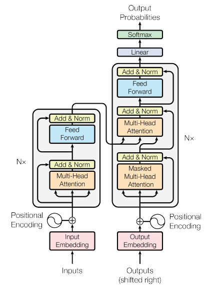

### Background

Before Transformers, most NLP models relied heavily on Recurrent Neural Networks (RNNs) and Long Short-Term Memory networks (LSTMs) to process text data sequentially. These models had limitations, especially in handling long-distance dependencies and parallel processing.

### The Core Idea: Attention Mechanism

1. **Attention Mechanism**: The Transformer model is based on the idea that you can use "attention" mechanisms to weigh the importance of different parts of the input data. In the context of language, this means the model learns to focus more on relevant words when trying to understand or translate a sentence.
    
2. **Self-Attention**: A key innovation in the Transformer is the use of self-attention. This allows the model to look at other words in the input sentence as it processes each word. For example, when processing the word "bank" in the sentence "He went to the bank to get money", the model will learn to pay more attention to "money" to understand that "bank" refers to a financial institution rather than the side of a river.
    

### Advantages of Transformers

1. **Parallelisation**: Unlike RNNs and LSTMs, Transformers process all words in a sentence simultaneously. This parallelisation makes them much faster and more efficient, especially for longer sentences.
    
2. **Handling Long-Distance Dependencies**: Transformers are better at understanding relationships between words that are far apart in a sentence, a task that was challenging for RNNs and LSTMs.
    
3. **Flexibility and Scalability**: The Transformer architecture is highly flexible and has been adapted for a wide range of language tasks beyond just translation, like text generation, summarisation, and question-answering.
    

### Structure of the Transformer

- The Transformer model has two main parts: the Encoder and the Decoder.
    
    - **Encoder**: It processes the input data (like a sentence in English) and generates a representation of it.
    - **Decoder**: It takes the encoder's output and generates the final output (like a translated sentence in French).
- Both the encoder and decoder are made up of layers that include self-attention mechanisms and feed-forward neural networks.
    

### Impact

The introduction of the Transformer model has led to the development of several state-of-the-art models in NLP, such as BERT, GPT (Generative Pre-trained Transformer), and others, which have significantly advanced the capabilities in various language understanding tasks.

In summary, the "Attention Is All You Need" paper introduced a novel architecture that shifted the focus from sequential processing of text to a model that leverages attention mechanisms to process entire sentences simultaneously, leading to significant improvements in speed, efficiency, and performance in NLP tasks.

