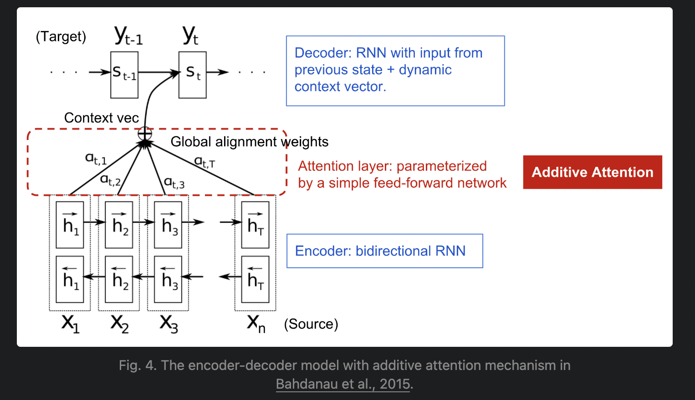
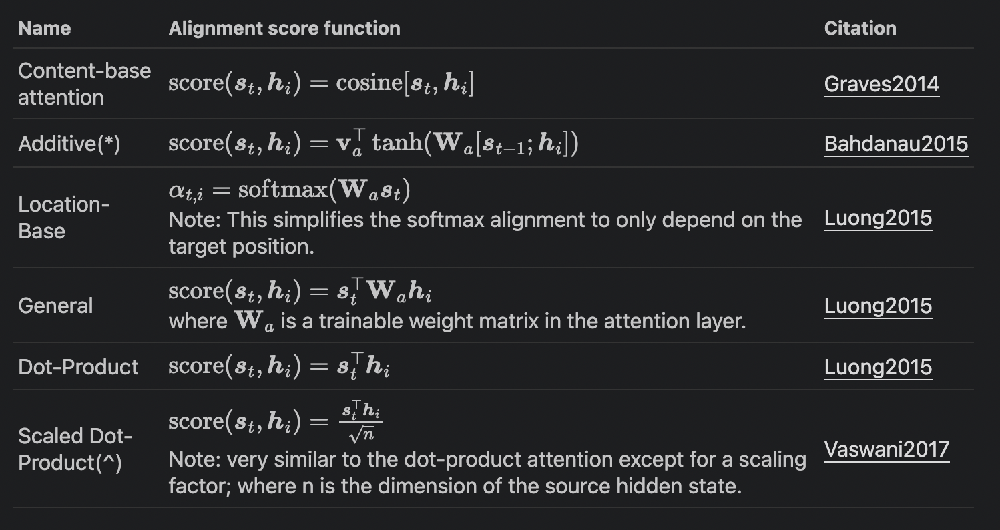
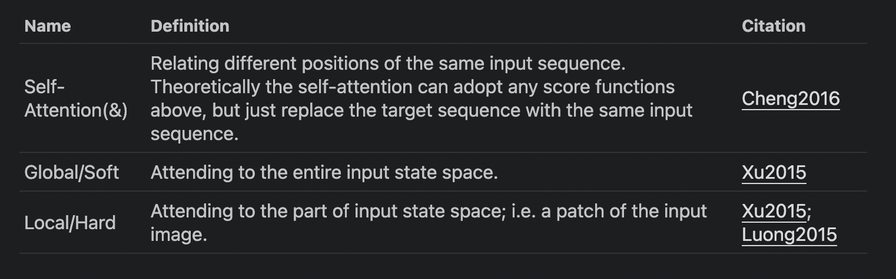

# What’s Wrong with Seq2Seq Model?

The **seq2seq** model was born in the field of language modeling ([Sutskever, et al. 2014](https://arxiv.org/abs/1409.3215)). Broadly speaking, it aims to transform an input sequence (source) to a new one (target) and both sequences can be of arbitrary lengths. Examples of transformation tasks include machine translation between multiple languages in either text or audio, question-answer dialog generation, or even parsing sentences into grammar trees.

The seq2seq model normally has an encoder-decoder architecture, composed of:

- An **encoder** processes the input sequence and compresses the information into a context vector (also known as sentence embedding or “thought” vector) of a _fixed length_. This representation is expected to be a good summary of the meaning of the _whole_ source sequence.
- A **decoder** is initialized with the context vector to emit the transformed output. The early work only used the last state of the encoder network as the decoder initial state.

Both the encoder and decoder are recurrent neural networks, i.e. using [LSTM or GRU](http://colah.github.io/posts/2015-08-Understanding-LSTMs/) units.

A critical and apparent disadvantage of this fixed-length context vector design is incapability of remembering long sentences. Often it has forgotten the first part once it completes processing the whole input. The attention mechanism was born ([Bahdanau et al., 2015](https://arxiv.org/pdf/1409.0473.pdf)) to resolve this problem.

# Born for Translation

The attention mechanism was born to help memorize long source sentences in neural machine translation ([NMT](https://arxiv.org/pdf/1409.0473.pdf)). Rather than building a single context vector out of the encoder’s last hidden state, the secret sauce invented by attention is to create shortcuts between the context vector and the entire source input. The weights of these shortcut connections are customizable for each output element.

While the context vector has access to the entire input sequence, we don’t need to worry about forgetting. The alignment between the source and target is learned and controlled by the context vector. Essentially the context vector consumes three pieces of information:

- encoder hidden states;
- decoder hidden states;
- alignment between source and target.

## Score Functions

## General Attention Mechanisms

## Self-Attention

**Self-attention**, also known as **intra-attention**, is an attention mechanism relating different positions of a single sequence in order to compute a representation of the same sequence. It has been shown to be very useful in machine reading, abstractive summarization, or image description generation.

The [long short-term memory network](https://arxiv.org/pdf/1601.06733.pdf) paper used self-attention to do machine reading. In the example below, the self-attention mechanism enables us to learn the correlation between the current words and the previous part of the sentence.

Fig. 6. The current word is in red and the size of the blue shade indicates the activation level. (Image source: [Cheng et al., 2016](https://arxiv.org/pdf/1601.06733.pdf))

## Soft vs Hard Attention

In the [show, attend and tell](http://proceedings.mlr.press/v37/xuc15.pdf) paper, attention mechanism is applied to images to generate captions. The image is first encoded by a CNN to extract features. Then a LSTM decoder consumes the convolution features to produce descriptive words one by one, where the weights are learned through attention. The visualization of the attention weights clearly demonstrates which regions of the image the model is paying attention to so as to output a certain word.

Fig. 7. "A woman is throwing a frisbee in a park." (Image source: Fig. 6(b) in [Xu et al. 2015](http://proceedings.mlr.press/v37/xuc15.pdf))

This paper first proposed the distinction between “soft” vs “hard” attention, based on whether the attention has access to the entire image or only a patch:

- **Soft** Attention: the alignment weights are learned and placed “softly” over all patches in the source image; essentially the same type of attention as in [Bahdanau et al., 2015](https://arxiv.org/abs/1409.0473).
    - _Pro_: the model is smooth and differentiable.
    - _Con_: expensive when the source input is large.
- **Hard** Attention: only selects one patch of the image to attend to at a time.
    - _Pro_: less calculation at the inference time.
    - _Con_: the model is non-differentiable and requires more complicated techniques such as variance reduction or reinforcement learning to train. ([Luong, et al., 2015](https://arxiv.org/abs/1508.04025))

## Global vs Local Attention

[Luong, et al., 2015](https://arxiv.org/pdf/1508.04025.pdf) proposed the “global” and “local” attention. The global attention is similar to the soft attention, while the local one is an interesting blend between [hard and soft](https://lilianweng.github.io/posts/2018-06-24-attention/#soft-vs-hard-attention), an improvement over the hard attention to make it differentiable: the model first predicts a single aligned position for the current target word and a window centered around the source position is then used to compute a context vector.

Fig. 8. Global vs local attention (Image source: Fig 2 & 3 in [Luong, et al., 2015](https://arxiv.org/pdf/1508.04025.pdf))

# Neural Turing Machines

Alan Turing in [1936](https://en.wikipedia.org/wiki/Turing_machine) proposed a minimalistic model of computation. It is composed of a infinitely long tape and a head to interact with the tape. The tape has countless cells on it, each filled with a symbol: 0, 1 or blank (" “). The operation head can read symbols, edit symbols and move left/right on the tape. Theoretically a Turing machine can simulate any computer algorithm, irrespective of how complex or expensive the procedure might be. The infinite memory gives a Turing machine an edge to be mathematically limitless. However, infinite memory is not feasible in real modern computers and then we only consider Turing machine as a mathematical model of computation.

Fig. 9. How a Turing machine looks like: a tape + a head that handles the tape. (Image source: [http://aturingmachine.com/](http://aturingmachine.com/))

**Neural Turing Machine** (**NTM**, [Graves, Wayne & Danihelka, 2014](https://arxiv.org/abs/1410.5401)) is a model architecture for coupling a neural network with external memory storage. The memory mimics the Turing machine tape and the neural network controls the operation heads to read from or write to the tape. However, the memory in NTM is finite, and thus it probably looks more like a “Neural [von Neumann](https://en.wikipedia.org/wiki/Von_Neumann_architecture) Machine”.

NTM contains two major components, a _controller_ neural network and a _memory_ bank. Controller: is in charge of executing operations on the memory. It can be any type of neural network, feed-forward or recurrent. Memory: stores processed information. It is a matrix of size �×�, containing N vector rows and each has � dimensions.

In one update iteration, the controller processes the input and interacts with the memory bank accordingly to generate output. The interaction is handled by a set of parallel _read_ and _write_ heads. Both read and write operations are “blurry” by softly attending to all the memory addresses.

