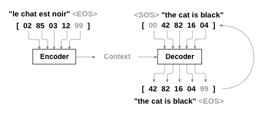

### Word Embedding and Word2Vec

Word Embeddings that correlate similar words with each other with similar numbers help neural network learn faster and more efficiently, in comparison for example with random word to number mappings.

Word2Vec algorithms
- **Continuous Bag of Words**: Uses the surrounding words to predict the middle word
- **Skip Gram**: uses the middle word to predict the surrounding words

Word2Vec speeds things up by using Negative Sampling (ignore irellevant weights)

## Encoder Decoder - {Supervised}

- Machine Translation: eg. RNN enc/dec, for short  translations. The encoder processes the input sentence in the source language, capturing its semantic and syntactic properties. The decoder then generates the translation in the target language, often one word or token at a time.
	- **Objective**: Minimise the difference between the generated sequence and the ground truth sequence (not input seq).
	- **Common Loss Function**: Cross-entropy loss is widely used, which measures the difference between the predicted probability distribution of the output words and the actual distribution.

- Transcribe (Audio->Text): The encoder processes the audio signal, extracting relevant features and context, while the decoder translates these features into corresponding text.
	- **Objective**: Minimise the error between the transcribed text and the actual spoken words.
	- **Common Loss Function**: Connectionist Temporal Classification (CTC) loss is often used for models where alignment between the audio and the text is not known.

## TTS Transformers
Models like Tacotron 2, Wavenet, FastSpeech etc, Flowtron

- Text2Speech (Text->Audio): The encoder analyses the text, and the decoder generates the audio waveform that corresponds to the spoken version of that text.
	- **Objective**: Minimise the difference between the generated caption and the reference caption.
	- **Common Loss Function**: Cross-entropy loss on the output tokens, and sometimes reinforcement learning techniques are used to directly optimise for evaluation metrics like BLEU or CIDER. (*Use established metrics like Word Error Rate (WER) for speech recognition, BLEU, ROUGE, or METEOR scores for language translation, and MOS (Mean Opinion Score) for subjective evaluations in a more standardised way.*)