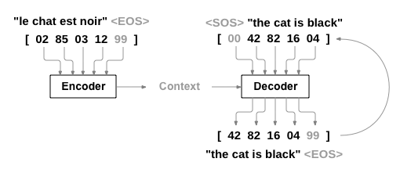
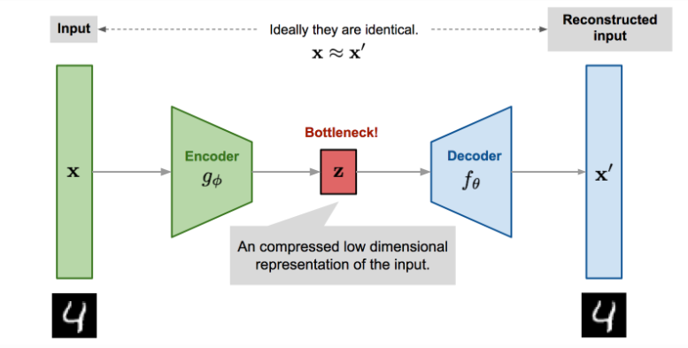
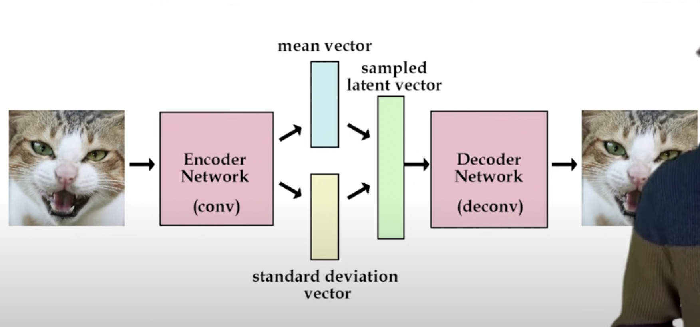

## Encoder Decoder - {Supervised}

- Machine Translation: eg. RNN enc/dec, for short  translations. The encoder processes the input sentence in the source language, capturing its semantic and syntactic properties. The decoder then generates the translation in the target language, often one word or token at a time.
	-  **Objective**: Minimise the difference between the generated sequence and the ground truth sequence (not input seq).
	- **Common Loss Function**: Cross-entropy loss is widely used, which measures the difference between the predicted probability distribution of the output words and the actual distribution.
	- 
- Transcribe (Audio->Text): The encoder processes the audio signal, extracting relevant features and context, while the decoder translates these features into corresponding text.
	- **Objective**: Minimise the error between the transcribed text and the actual spoken words.
	- **Common Loss Function**: Connectionist Temporal Classification (CTC) loss is often used for models where alignment between the audio and the text is not known.

- Text2Speech (Text->Audio): The encoder analyses the text, and the decoder generates the audio waveform that corresponds to the spoken version of that text.
	- **Objective**: Minimize the difference between the generated caption and the reference caption.
	- **Common Loss Function**: Cross-entropy loss on the output tokens, and sometimes reinforcement learning techniques are used to directly optimise for evaluation metrics like BLEU or CIDER. (*Use established metrics like Word Error Rate (WER) for speech recognition, BLEU, ROUGE, or METEOR scores for language translation, and MOS (Mean Opinion Score) for subjective evaluations in a more standardized way.*)

## Auto-Encoders {Unsupervised}

The idea is to compare the Encoder input and the Decoder output and minimise their difference.

- Anomaly Detection: For Loss you compare the input with the output, If for a test sample the loss is high (while the auto-encoder is trained on 'healthy' samples) then you have an anomaly.

- SuperResolution: image + noise -> image (*for loss you just compare the {image,image} without noise*)

- Dimensionality Reduction (eg. Image Compression): you are just utilising the trained encoder, to compress, for decompression use the decoder. (* try to push the latent vector low*)

- Feature Extraction: The encoding part (feat. extract) + Classifiers/Regressors etc. (*this is particularly useful when you have a lot of unlabelled data, and wanna build a classifier with just a few labelled data. Auto-Encoders are unsupervised.*)

## Variational Auto-Encoders {Unsupervised}

## Attention 

## Transformers