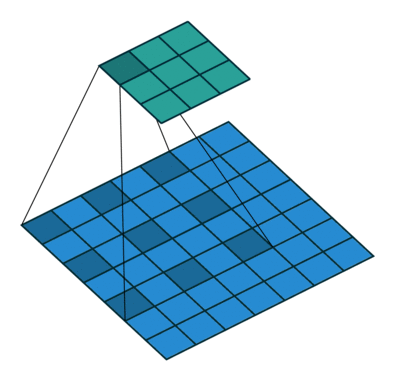

### Randomness in Training

- **Shuffling**: When you shuffle your dataset using `DataLoader`, the order in which samples are fed to the model varies, introducing randomness. This is usually done to prevent the model from learning the order of the data.

- **Data Augmentation**: Random transformations in data augmentation (like random crops, flips, rotations in images, or perturbations in audio data) introduce variability.

- **Weight Init**: Models often start with randomly initialised weights. The method of initialisation (e.g., Xavier, Kaiming) can affect training dynamics.

- **Dropout** is a regularisation technique where randomly selected neurons are ignored during training. The randomness in which neurons are dropped introduces variability.

- **Stochastic Optimization**: Algorithms like Stochastic Gradient Descent (SGD) use mini-batches randomly sampled from the dataset, introducing randomness in the optimisation process.

- **Parallelisation**: Certain operations on GPUs can have non-deterministic outcomes due to parallel execution. This is less predictable  CPU operations and can introduce slight variations.

- **Stochastic Models**: Like Variational Autoncoders etc. are not deterministic. All the models incorporating Noise in some extent, or normal distributions.


### Bias and Variance

- **Bias**: We usually have it when we are trying describe complex data with simple functions. High bias can cause under-fitting.
- **Variance**: Error from too much sensitivity to the fluctuations in the training data. High variance can cause overfitting.
- **Tradeoff**: The need to manage the compromise between bias and variance to prevent under-fitting and overfitting and to achieve good generalisation on new data.

### Convolution

Stride: the step size the convolutional filter takes while moving across the input feature map.
Padding: adding extra pixels/units (usually zeros) around the border of the input feature map.

Output size=(Input size−Filter size+2xPadding​)/Stride+1

### Dilated Convolutions (atrous conv)



Can model more long term dependencies on data.
We use it on Vocoders (Wavenet, Spectro -> Sound)
You just add the dilation flag in Conv2d

```python
self.dilated_conv = nn.Conv2d(in_channels, out_channels, kernel_size, stride=stride, padding=padding, dilation=dilation)
```

### Deconvolution

It is the transpose operation of Convolution, we use it to upsample.
```python
self.deconv = nn.ConvTranspose2d(in_channels, out_channels, kernel_size, stride, padding)
```

### Deconvolution vs Upsampling

- **Deconvolution (Transposed Convolution)**: A convolutional operation with learnable parameters used to increase the spatial dimensions of data, allowing the network to learn how to upsample.
- **Upsampling**: A simpler, non-learnable method to increase spatial dimensions, often followed by a convolution to allow the network to learn from the upsampled data. (Nearest neighbour, interpolation etc.)

