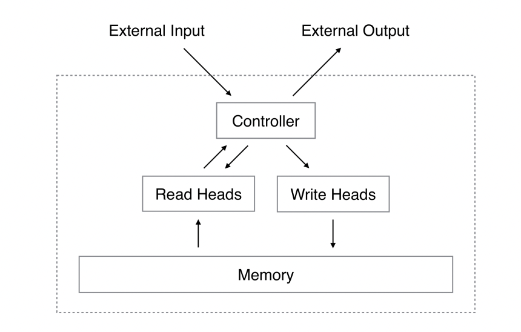

### Basic Concept

- **Inspiration from Turing Machines**: A Turing machine is a mathematical model of computation that manipulates symbols on a strip of tape according to a set of rules. It's a fundamental concept in computer science for understanding what can be computed.
- **Combining with Neural Networks**: The NTM integrates this concept with neural networks. Just like a Turing machine has a tape for storage, the NTM has a memory bank. However, unlike the discrete operations of a Turing machine, the NTM operates in a differentiable way, meaning it can learn to read from and write to this memory smoothly over time.

### Key Components

1. **Controller**: At the heart of the NTM is a neural network (the controller), which can be a feedforward or recurrent network. This controller interacts with an external memory matrix.
    
2. **Memory Matrix**: This is akin to the tape in a Turing machine. It's a 2D matrix where each row is a memory location. The NTM can read from and write to this memory.
    
3. **Read and Write Heads**: These are mechanisms that allow the controller to interact with the memory matrix. The read head retrieves data from the memory, while the write head updates the memory contents.
    

### How It Works

- **Learning to Use Memory**: The NTM learns how to use its memory to perform tasks. For example, it can learn to store important information in memory and retrieve it later, which is crucial for tasks that require keeping track of past information.
    
- **Differentiable Operations**: The operations of reading and writing are designed to be differentiable, which means they can be optimised using standard back-propagation techniques in machine learning. This is a key feature as it allows the NTM to learn from data.
    
- **Addressing Mechanisms**: The NTM uses a soft (fuzzy) addressing mechanism to read and write in the memory, which is based on content (finding a memory cell based on its content) and location (relative positioning).
    

### Applications

- **Algorithm Learning**: NTMs can learn simple algorithms from examples, such as copying, sorting, or recalling sequences.
- **Problem Solving**: They are designed to perform well on tasks that require both processing power (via the neural network) and a form of memory (the external matrix)

